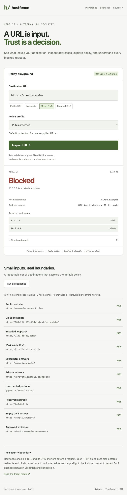

# hostfence

[](https://github.com/hon900/hostfence/actions/workflows/ci.yml)
[](LICENSE)

**Know where a URL points before your server requests it.**

hostfence is a zero-runtime-dependency URL and DNS policy validator for Node.js.
It normalizes unusual address encodings, inspects every resolved address, and
returns readable rejection reasons. Use it at webhook, preview, and import
boundaries that accept a URL from a user.

Maintained by [@hon900](https://github.com/hon900), with a focus on SSRF defense,
DNS validation, and the gap between a policy decision and an actual connection.
The [research notes](docs/research/README.md) reproduce implementation failures
against fixed source revisions. The [architecture](docs/architecture.md) and
[maintainer runbook](docs/maintainer-runbook.md) explain the protection boundary
and release process.

> **Security boundary:** `assert()` is a preflight. DNS can change between
> the check and `fetch(url)` unless the client connects to `result.pin`.
> `assertPin()` returns a checked address; install `pinLookup()` in the client's
> actual socket connector and retain the original Host/TLS identity. The
> [fetch wrapper](https://github.com/hon900/hostfence-fetch/tree/v1.3.1) and
> [owned Undici agent](https://github.com/hon900/undici-ssrf/tree/v0.9.1) implement
> that integration. Disable automatic redirects and re-check every hop with
> `checkHop()`. See [SECURITY.md](SECURITY.md).

## Research: from a checked URL to a verified connection

| Case study | Finding | Evidence |
| --- | --- | --- |
| [Hostname evidence is not a DNS answer](docs/research/hostname-evidence-vs-dns-pinning.md) | A hostname-derived IP could become a connection pin without being returned by DNS. | Compare hostfence 1.4.0 and 1.4.1 with deterministic resolver fixtures. |
| [A dispatch option is not a socket connector](docs/research/undici-dispatch-vs-connect.md) | The adapter supplied a pinned lookup at a layer Undici did not use to connect. | Compare the historical adapter commit with 0.9.1 using controlled local sockets. |

Each report includes the tested revisions, a minimal reproducer, before/after
results, and limits on the conclusion. These are investigations of this
maintainer's own code; known SSRF techniques are distinguished from the specific
implementation defects. Start with the [research guide and Korean summary](docs/research/README.md).

```sh
npm run research:install
npm run research
```

Installation downloads locked dependencies from GitHub/npm. The experiments
use injected DNS answers and local fixtures; they do not probe external targets.

## Try the policy lab

```bash
npm ci
npm run demo
```

The local playground demonstrates decisions with deterministic DNS fixtures.
It does not fetch the submitted destination. Run `npm test` for the regression
suite.



## Install

```bash
npm install github:hon900/hostfence#v1.4.1
```

The tag pins the reviewed source and builds the TypeScript package at install
time. See [CHANGELOG.md](CHANGELOG.md) for behavior changes before updating.

## Validate a destination

```js
import { Hostfence, HostfenceError } from "hostfence";

const fence = new Hostfence({
  protocols: ["https"],
  allowedHosts: ["api.partner.example"],
  allowedPorts: [443],
  lookupTimeoutMs: 2_000,
});

try {
  const { url, pin } = await fence.assertPin("https://api.partner.example/events");
  // Connect to pin.address (family pin.family) with SNI/Host pin.servername.
  console.log(url.hostname, pin);
} catch (err) {
  if (err instanceof HostfenceError) console.error(err.reasons);
  else throw err;
}
```

Use `check()` when you want a decision without throwing for a policy rejection:

```js
const result = await fence.check("http://127.0.0.1/admin");
// {
//   ok: false,
//   url: URL,
//   hostname: "127.0.0.1",
//   addresses: ["127.0.0.1"],
//   reasons: [/* protocol, port, allow-list and loopback failures */]
// }
```

Malformed URLs still throw `HostfenceError` with code `HOSTFENCE_INVALID_URL`.
`assert()` throws `HOSTFENCE_BLOCKED` for a valid URL rejected by policy.
DNS failures, timeouts, empty answers, and malformed resolver responses yield
`ok: false`. Already-rejected hostnames are not looked up. Duplicate DNS answers
and rejection reasons are removed.

`addresses` contains all address evidence checked by the policy, including IPs
encoded in wildcard DNS names such as `8.8.8.8.nip.io`. Those hostname hints
can reject a destination but cannot authorize a connection. `pin.address`
always comes from a successful DNS answer or an IP literal in the URL; an
empty DNS response is rejected even when the hostname embeds a permitted IP.

## Policy reference

| Option | Default | Effect |
| --- | --- | --- |
| `protocols` | `["http", "https"]` | Allowed URL schemes; case and a trailing colon are normalized. |
| `allowedHosts` | Unrestricted | Exact hostname/IP allow list; `[]` denies all. DNS address checks still apply. |
| `allowedPorts` | Unrestricted | Allowed effective ports, including implicit `80`/`443`; `[]` denies all. |
| `extraDeniedHosts` | `[]` | Exact additional hostname/IP deny list. Deny rules win. |
| `extraDeniedCidrs` | `[]` | Additional IPv4 or IPv6 CIDRs; invalid configuration throws `TypeError`. |
| `lookupTimeoutMs` | `5000` | Positive integer maximum wait for DNS. |
| `lookup` | OS resolver | Async `(hostname) => string[]`; every returned address must be a valid, permitted IP. |
| `allowCredentials` | `false` | Permit URL username/password when explicitly enabled. |
| `allowPrivate` | `false` | Permit RFC1918 IPv4 ranges. |
| `allowLoopback` | `false` | Permit loopback addresses and local-style hostname suffixes. |
| `allowLinkLocal` | `false` | Permit link-local ranges, including link-local metadata IPs. |
| `allowUniqueLocal` | `false` | Permit IPv6 ULA. |
| `allowCgnat` | `false` | Permit shared IPv4 space, except the separately classified metadata IP. |
| `allowMetadata` | `false` | Permit listed metadata hostnames and classified metadata addresses (`100.100.100.200`, `168.63.129.16`, `fd00:ec2::254`); other policy checks still apply. |

Host lists use the same normalization as request URLs: case, surrounding
whitespace, trailing dots, IDNA, unusual IPv4 representations, and IPv6
compression. Supply hostnames or IP addresses, without schemes, ports, paths,
or wildcards. Checks remain cumulative; an allow list never bypasses address
restrictions. Use all opt-in flags narrowly.

Link-local destinations such as `169.254.169.254` remain governed by
`allowLinkLocal`; `allowMetadata` alone does not permit them.

Timeouts stop waiting for DNS but cannot cancel an OS lookup or an injected
resolver. A custom resolver must remain asynchronous; a blocked JavaScript
thread cannot be interrupted by the timeout.

## Default address coverage

- Loopback, RFC1918, link-local, CGNAT, IPv6 ULA, unspecified, and multicast.
- Cloud metadata names, Alibaba `100.100.100.200`, Azure wire-server
  `168.63.129.16`, and AWS IPv6 metadata `fd00:ec2::254`.
- IPv4 documentation and benchmark ranges, reserved `192.0.0.0/24` and `240/4`.
- IPv6 documentation (`2001:db8::/32`, `3fff::/20`), benchmark `2001:2::/48`,
  discard-only/dummy ranges, local-use translation, and SRv6 SID space.
- IPv4-mapped IPv6 in compressed, expanded, hexadecimal, and dotted forms.
- Invalid resolver output and scoped IPv6 answers are rejected.

`classifyAddress(ip)` returns an address category; `"public"` means it did not
match this library's blocked categories. It is not a guarantee of global
routability or the safety of a service. Reserved classifications follow the
[IANA IPv4](https://www.iana.org/assignments/iana-ipv4-special-registry/) and
[IANA IPv6](https://www.iana.org/assignments/iana-ipv6-special-registry/)
registries conservatively; this is not a complete registry implementation.

## Contributing and security

Run `npm test` to compile TypeScript and execute the offline regression suite.
Tests cover encoded IPv4, IPv6 equivalence, range boundaries, malformed DNS,
configuration errors, hostname normalization, and timeout behavior.

See [SECURITY.md](SECURITY.md), [MAINTAINERS.md](MAINTAINERS.md), and
[ADOPTION.md](ADOPTION.md). Report suspected bypasses through
[private vulnerability reporting](https://github.com/hon900/hostfence/security/advisories/new).

## License

MIT
