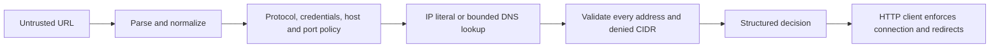

# Architecture and trust boundaries

Hostfence makes a policy decision about a destination. It does not send the request. Keeping these responsibilities separate allows the same engine to support a fetch wrapper, webhook validation, an Undici dispatcher and a CLI.

## Decision pipeline



1. The WHATWG URL parser normalizes numeric IPv4 encodings, bracketed IPv6 and internationalized hostnames. Hostname policy entries use the same normalization.
2. Protocol, credentials, exact-host restrictions and effective port are checked before DNS. A rejected hostname does not trigger a lookup.
3. IP literals are classified directly. Hostnames use an injectable resolver with a finite waiting time. Empty answers, invalid addresses, lookup errors and timeouts fail closed.
4. Every address must pass. A public address in a mixed answer does not authorize an accompanying private address. Additional CIDRs are explicit denials, even when a category is otherwise permitted.
5. `check()` returns the decision, normalized URL, hostname, addresses and reasons. A malformed URL throws `HOSTFENCE_INVALID_URL`. `assert()` also throws for rejected destinations.

## Policy composition

An allowlist narrows the destination set; it does not override IP classification. Likewise, `allowPrivate` does not authorize metadata, loopback, arbitrary protocols or explicitly denied CIDRs. Invalid CIDR configuration throws during construction so a spelling error cannot quietly disable a rule.

Credentials are rejected by default. `allowedPorts`, when provided, uses the effective HTTP/HTTPS port, including the default when the URL omits it. Category exceptions should be enabled only for a deployment that intentionally needs them.

## Transport responsibilities

| Component | Enforces | Does not enforce |
| --- | --- | --- |
| Core engine | URL policy and all addresses returned by its lookup | Socket destination, redirects, response size |
| Fetch adapter | Preflight plus rejection of automatic redirect following | DNS pinning, response-body budget |
| Webhook guard | Callback destination policy | Delivery, retries, signatures |
| Preview adapter | Preflight, redirect rejection, HTML response, bounded bytes and waiting | Full HTML parsing, image fetching, DNS pinning |
| Undici interceptor | Per-dispatch origin checks and handler error delivery | Path/header authorization, socket DNS pinning or downstream backpressure propagation while validation is queued |
| CLI | Repeatable decisions, machine-readable output and exit codes | Sending requests |

DNS may change after validation and before a separate client lookup. A complete deployment must bind its connection to the validated address, maintain TLS hostname verification, check each redirect, and apply network-level egress controls. The default resolver's timeout stops waiting; it cannot cancel operating-system resolver work. Do not cache authorization decisions across unrelated requests.

## Reproducible playground

```sh
npm ci
npm run demo
```

Open the loopback URL printed by the server. The example imports the compiled core directly and substitutes a deterministic lookup. It never fetches submitted destinations, uses an explicit static-file map, enforces local Host/Origin headers, limits request bodies and does not persist submissions.

The scenario suite always uses the default policy. The inspector also provides a webhook policy restricted to `https://hooks.example.com:443`. An unknown hostname fails because it has no fixture record; this is a fixture limitation, not a live DNS verdict. Test IP literals or use the documented example hostnames.

## Verification strategy

Address and policy tests use fixed vectors. Integration tests replace external fetch/DNS with explicit stubs; the Undici adapter also exercises a real MockAgent. The playground test uses an ephemeral loopback listener to test HTTP behavior without contacting the internet. Tests establish the implemented boundaries, not a claim of universal SSRF prevention.

Release notes must call out behavior changes such as credential rejection, invalid-policy errors and redirect restrictions. Existing public function names remain stable; new controls are additive. Transport restrictions that close an unsafe default are described in each adapter's migration notes.
